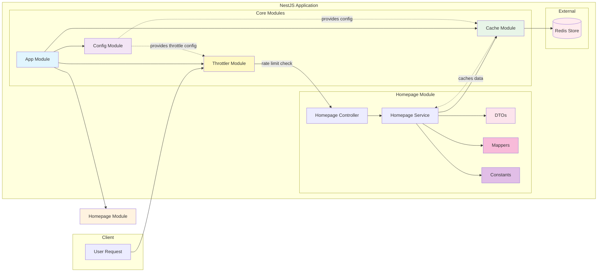

## Architecture

This application uses a modular architecture with the following components and data flow:



## Description

A NestJS application with Redis caching and rate limiting (throttling) for efficient data storage and retrieval. This project demonstrates:
- Redis integration using `@nestjs/cache-manager` module
- Centralized configuration management with `@nestjs/config`
- Rate limiting with `@nestjs/throttler` module with multiple throttle strategies

## Installation

```bash
$ pnpm install
```

## Running the application

### Using Docker (Recommended)

1. Ensure Docker and Docker Compose are installed.
2. Run the following command to start the application and Redis:

```bash
docker-compose up
```

The application will be available at http://localhost:3000.

### Using npm/pnpm scripts

1. Install dependencies:

```bash
pnpm install
```

2. Start Redis (if not using Docker):

Make sure Redis is running on your system.

3. Run the application:

```bash
pnpm run start:dev
```

The application will be available at http://localhost:3000.

### Key Components:
- **App Module**: The root module that orchestrates all other modules.
- **Config Module**: Manages environment variables for configuration (Redis, Throttler settings).
- **Cache Module**: Integrates Redis as the cache store, configurable via the Config Module.
- **Throttler Module**: Implements rate limiting with three throttle profiles (short, medium, long).

## Configuration

### Environment Variables

Create a `.env` file in the root directory with the following variables:

```env
# Redis
REDIS_HOST=127.0.0.1
REDIS_PORT=6379

# Throttlers (TTL values in milliseconds)
SHORT_THROTTLE_NAME=short
SHORT_THROTTLE_TTL=1000
SHORT_THROTTLE_LIMIT=3

MEDIUM_THROTTLE_NAME=medium
MEDIUM_THROTTLE_TTL=10000
MEDIUM_THROTTLE_LIMIT=20

LONG_THROTTLE_NAME=long
LONG_THROTTLE_TTL=60000
LONG_THROTTLE_LIMIT=100
```

### Throttler Profiles

- **Short**: Allows 3 requests per second
- **Medium**: Allows 20 requests per 10 seconds
- **Long**: Allows 100 requests per 60 seconds

When rate limits are exceeded, the API responds with a `429 (Too Many Requests)` status code.
- **Homepage Module**: Demonstrates cache usage with controller, service, DTOs, mappers, and constants for handling requests.
- **DTOs**: Data Transfer Objects for structuring request/response data.
- **Mappers**: Utility functions to transform data between different formats.
- **Constants**: Centralized constants like API URLs.
- **Redis Store**: External Redis instance for data caching.

The diagram shows the request flow from user to controller, through service to cache, and finally to Redis storage.

## Logging

This application implements comprehensive logging throughout using NestJS's built-in `Logger` class:

- **Service Layer**: Logs method entry points, successful operations (e.g., "Fetched data from API and cached it"), and errors with stack traces.
- **Error Handling**: Structured error logging with context, including method names and error details.
- **Cache Operations**: Implicit logging through cache manager for cache hits/misses (via Redis).

Logging helps with debugging, monitoring application health, and tracking performance in development and production environments.

## Project Structure

```
redis-cache-store/
├── docker-compose.yml
├── nest-cli.json
├── package.json
├── pnpm-lock.yaml
├── README.md
├── tsconfig.build.json
├── tsconfig.json
├── .env
├── .env.example
├── src/
│   ├── app.controller.spec.ts
│   ├── app.controller.ts
│   ├── app.module.ts
│   ├── app.service.ts
│   ├── main.ts
│   └── homepage/
│       ├── constant/
│       │   ├── homepage-api-url.constant.ts
│       │   └── index.ts
│       ├── dto/
│       │   ├── homepage.response.dto.ts
│       │   └── index.ts
│       ├── mapper/
│       │   ├── homepage.response.mapper.ts
│       │   └── index.ts
│       ├── homepage.controller.ts
│       ├── homepage.module.ts
│       └── homepage.service.ts
└── test/
    ├── app.e2e-spec.ts
    └── jest-e2e.json
```

## Stay in touch

- Author - Sandip Das (Full Stack Developer | NodeJs | ReactJs | AWS)
- Email - sandip4991@gmail.com
- LinkedIn - https://www.linkedin.com/in/sandipdas-software/

## License

This application is [MIT licensed](LICENSE).
