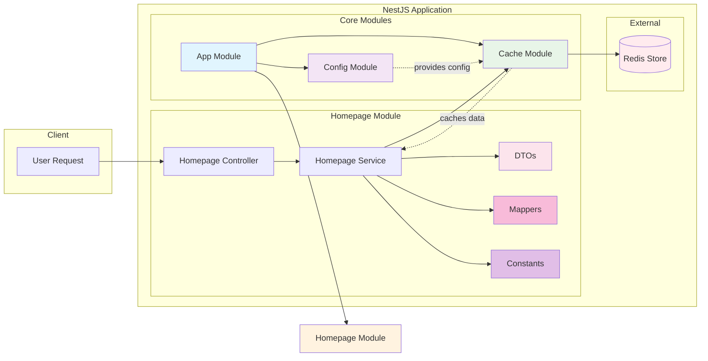

<p align="center">
  <a href="http://nestjs.com/" target="blank"></a>
</p>

[circleci-image]: https://img.shields.io/circleci/build/github/nestjs/nest/master?token=abc123def456
[circleci-url]: https://circleci.com/gh/nestjs/nest


## Description

A NestJS application with Redis caching for efficient data storage and retrieval. This project demonstrates how to integrate Redis as a cache store in a NestJS application using the `@nestjs/cache-manager` module.

## Installation

```bash
$ pnpm install
```

## Architecture

This application uses a modular architecture with the following components and data flow:



### Key Components:
- **App Module**: The root module that orchestrates all other modules.
- **Config Module**: Manages environment variables for configuration (e.g., Redis host and port).
- **Cache Module**: Integrates Redis as the cache store, configurable via environment variables.
- **Homepage Module**: Demonstrates cache usage with controller, service, DTOs, mappers, and constants for handling requests.
- **DTOs**: Data Transfer Objects for structuring request/response data.
- **Mappers**: Utility functions to transform data between different formats.
- **Constants**: Centralized constants like API URLs.
- **Redis Store**: External Redis instance for data caching.

The diagram shows the request flow from user to controller, through service to cache, and finally to Redis storage.

## Logging

This application implements comprehensive logging throughout using NestJS's built-in `Logger` class:

- **Service Layer**: Logs method entry points, successful operations (e.g., "Fetched data from API and cached it"), and errors with stack traces.
- **Error Handling**: Structured error logging with context, including method names and error details.
- **Cache Operations**: Implicit logging through cache manager for cache hits/misses (via Redis).

Logging helps with debugging, monitoring application health, and tracking performance in development and production environments.

## Project Structure

```
redis-cache-store/
├── docker-compose.yml
├── nest-cli.json
├── package.json
├── pnpm-lock.yaml
├── README.md
├── tsconfig.build.json
├── tsconfig.json
├── .env
├── .env.example
├── src/
│   ├── app.controller.spec.ts
│   ├── app.controller.ts
│   ├── app.module.ts
│   ├── app.service.ts
│   ├── main.ts
│   └── homepage/
│       ├── constant/
│       │   ├── homepage-api-url.constant.ts
│       │   └── index.ts
│       ├── dto/
│       │   ├── homepage.response.dto.ts
│       │   └── index.ts
│       ├── mapper/
│       │   ├── homepage.response.mapper.ts
│       │   └── index.ts
│       ├── homepage.controller.ts
│       ├── homepage.module.ts
│       └── homepage.service.ts
└── test/
    ├── app.e2e-spec.ts
    └── jest-e2e.json
```

## Running the app

```bash
# development
$ pnpm run start

# watch mode
$ pnpm run start:dev

# production mode
$ pnpm run start:prod
```
## Running the redis server

```bash
docker compose up
```

## Test

```bash
# unit tests
$ pnpm run test

# e2e tests
$ pnpm run test:e2e

# test coverage
$ pnpm run test:cov
```

## Stay in touch

- Author - Sandip Das (Full Stack Developer | NodeJs | ReactJs | AWS)
- Email - sandip4991@gmail.com
- LinkedIn - https://www.linkedin.com/in/sandipdas-software/

## License

Nest is [MIT licensed](LICENSE).
