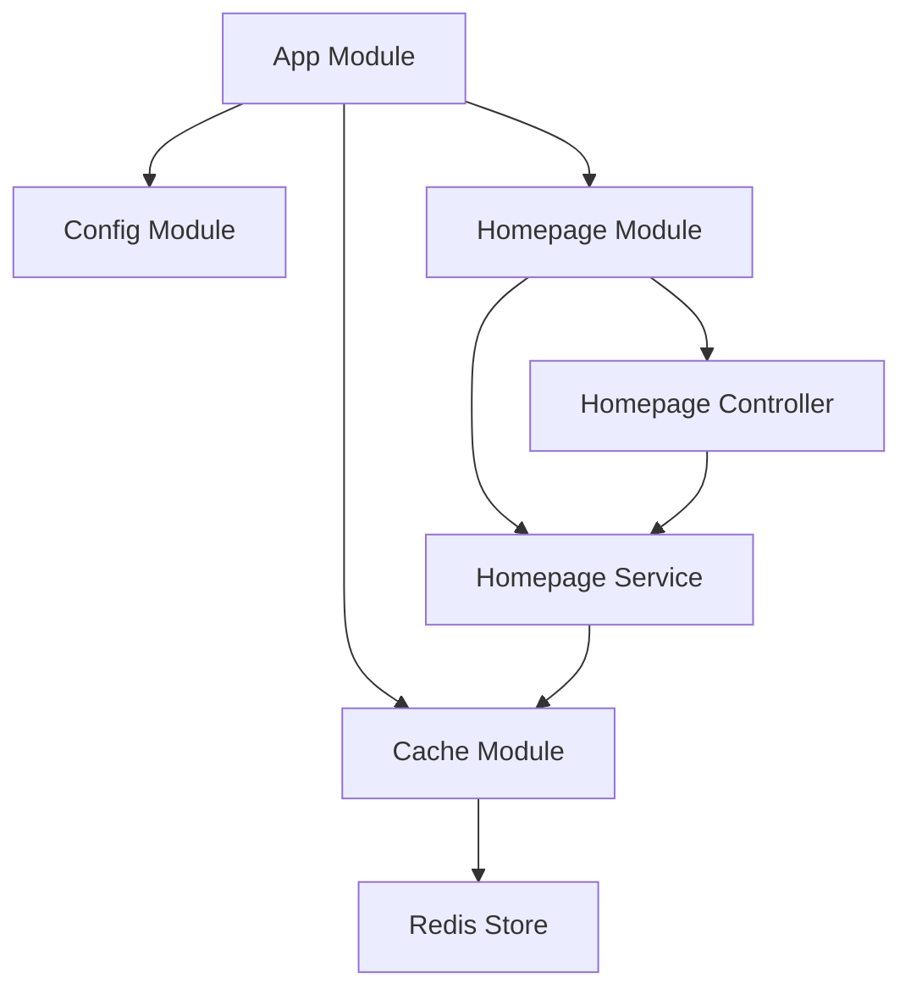

<p align="center">
  <a href="http://nestjs.com/" target="blank"></a>
</p>

[circleci-image]: https://img.shields.io/circleci/build/github/nestjs/nest/master?token=abc123def456
[circleci-url]: https://circleci.com/gh/nestjs/nest


## Description

A NestJS application with Redis caching for efficient data storage and retrieval. This project demonstrates how to integrate Redis as a cache store in a NestJS application using the `@nestjs/cache-manager` module.

## Installation

```bash
$ pnpm install
```

## Architecture

This application uses a modular architecture with the following components:



- **App Module**: The root module that imports all other modules.
- **Config Module**: Loads environment variables for configuration (e.g., Redis host and port).
- **Cache Module**: Configures Redis as the cache store with configurable host and port.
- **Homepage Module**: Contains the homepage controller and service, demonstrating cache usage.

## Project Structure

```
redis-cache-store/
├── docker-compose.yml
├── nest-cli.json
├── package.json
├── pnpm-lock.yaml
├── README.md
├── tsconfig.build.json
├── tsconfig.json
├── .env
├── .env.example
├── src/
│   ├── app.controller.spec.ts
│   ├── app.controller.ts
│   ├── app.module.ts
│   ├── app.service.ts
│   ├── main.ts
│   └── homepage/
│       ├── homepage.controller.ts
│       ├── homepage.module.ts
│       └── homepage.service.ts
└── test/
    ├── app.e2e-spec.ts
    └── jest-e2e.json
```

## Running the app

```bash
# development
$ pnpm run start

# watch mode
$ pnpm run start:dev

# production mode
$ pnpm run start:prod
```
## Running the redis server

```bash
docker compose up
```

## Test

```bash
# unit tests
$ pnpm run test

# e2e tests
$ pnpm run test:e2e

# test coverage
$ pnpm run test:cov
```

## Support

Nest is an MIT-licensed open source project. It can grow thanks to the sponsors and support by the amazing backers. If you'd like to join them, please [read more here](https://docs.nestjs.com/support).

## Stay in touch

- Author - Sandip Das
- Email - sandip4991@gmail.com

## License

Nest is [MIT licensed](LICENSE).
